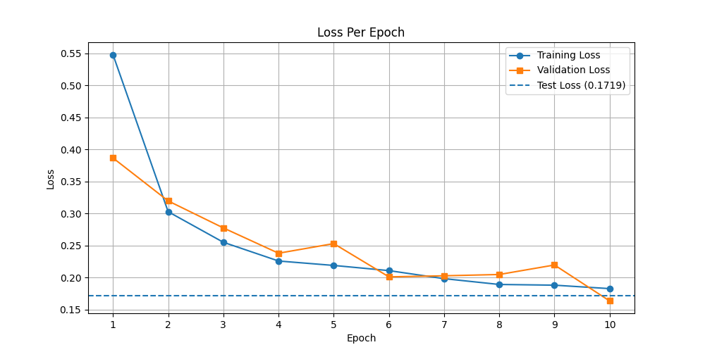

# 🍌 BananaClock

An AI-powered banana ripeness detector. Upload a photo of a banana and get back its ripeness stage along with an estimate of how many days until it becomes inedible.

## How It Works

BananaClock uses a fine-tuned **Microsoft ResNet-50** model (via Hugging Face `transformers`) trained on banana images across 4 ripeness stages:

| Stage      | Description                 |
| ---------- | --------------------------- |
| `overripe` | Soft and spotty, eat soon   |
| `ripe`     | Perfect to eat              |
| `rotten`   | Past the point of no return |
| `unripe`   | Green, not ready yet        |

The model predicts the stage and returns a human-readable time estimate based on the result.

## Project Structure

```
app/
├── main.py               # FastAPI app (trains model on startup)
├── api/
│   └── routes/
│       ├── health.py     # GET /api/health
│       ├── auth.py       # POST /api/auth/register, /api/auth/login
│       └── scans.py      # POST /api/scans, GET /api/scans, GET /api/scans/predict-inedible-day
├── services/
│   ├── model.py          # Loads and modifies ResNet-50
│   ├── train.py          # Training loop
│   ├── predict.py        # Single image prediction logic
│   └── scan_service.py   # Scan CRUD and inedible day prediction
└── core/
    ├── config.py         # Environment config
    ├── database.py       # Async PostgreSQL session
    ├── security.py       # JWT creation and verification
    └── deps.py           # FastAPI auth dependency
streamlit_app.py          # Streamlit UI
```

## Installation

```bash
python3 -m venv .venv
source .venv/bin/activate
pip install -r requirements.txt
```

Copy the environment file and configure your database URL:

```bash
cp .env.example .env
```

### Environment Variables

| Variable             | Default | Description                                                                                |
| -------------------- | ------- | ------------------------------------------------------------------------------------------ |
| `DATABASE_URL`       | —       | PostgreSQL connection string (asyncpg)                                                     |
| `JWT_SECRET`         | —       | Secret key for signing JWT tokens                                                          |
| `JWT_ALGORITHM`      | `HS256` | JWT algorithm                                                                              |
| `JWT_EXPIRE_MINUTES` | `60`    | Token expiry in minutes                                                                    |
| `RETRAIN`            | `true`  | Set to `false` to skip retraining on startup and use the existing `banana_clock_model.pth` |
| `TORCH_DEVICE`       | auto    | Force training device: `mps`, `cuda`, or `cpu`. Auto-detected if unset.                    |

## Training

### Dataset

This project was trained on the **Banana Ripeness Classification Dataset** from Kaggle:
[https://www.kaggle.com/datasets/shahriar26s/banana-ripeness-classification-dataset](https://www.kaggle.com/datasets/shahriar26s/banana-ripeness-classification-dataset)

To download it, install the Kaggle CLI and run:

```bash
pip install kaggle
kaggle datasets download -d shahriar26s/banana-ripeness-classification-dataset
unzip banana-ripeness-classification-dataset.zip -d datasets/
```

The dataset must be organised into three pre-split folders:

```
datasets/
├── train/
│   ├── overripe/
│   ├── ripe/
│   ├── rotten/
│   └── unripe/
├── valid/
│   ├── overripe/
│   ├── ripe/
│   ├── rotten/
│   └── unripe/
└── test/
    ├── overripe/
    ├── ripe/
    ├── rotten/
    └── unripe/
```

Training runs automatically on FastAPI server startup via `train_model()`. The trained weights are saved to `banana_clock_model.pth`.

To retrain manually:

```bash
source .venv/bin/activate
python -c "from app.services.train import train_model; train_model()"
```

After training completes, a loss graph is saved to `graphs/loss_over_time.png`. It plots training loss, validation loss, and test loss across all 10 epochs so you can visually inspect how the model converged.



### Using with Other Fruits 🍎🍊🥭

BananaClock is not limited to bananas. The model architecture (ResNet-50 with a 4-class head) works for any fruit with distinct ripeness stages. To adapt it:

1. Collect images for your fruit across 4 ripeness stages (e.g. `unripe`, `ripe`, `overripe`, `inedible`)
2. Organise them into `datasets/train/`, `datasets/valid/`, `datasets/test/` with one subfolder per class
3. Update `CLASS_NAMES` in `app/services/model.py` to match your folder names
4. Update `RIPENESS_VALUES` and `DAYS_LABEL` in `app/models/scan.py` to reflect the new stages
5. Retrain — the rest of the pipeline (API, Streamlit UI, scan history, predictions) works unchanged

## Running the API

```bash
fastapi dev app/main.py
```

The server starts at `http://127.0.0.1:8000`. Interactive docs at `http://127.0.0.1:8000/docs`.

## Running the Streamlit UI

```bash
streamlit run streamlit_app.py
```

The UI opens at `http://localhost:8501`.

### Page 1 — Scan

Enter your User ID, upload a banana photo, and click **Predict**. The app runs the AI model, shows the ripeness stage and days estimate, then saves the scan to PostgreSQL.

### Page 2 — History & Prediction

Enter your User ID and click **Load History**. The app fetches all your scans, plots a ripeness progression chart, and predicts the inedible date using linear regression (requires at least 2 scans).

## API Reference

| Method | Endpoint                          | Auth | Description                                 |
| ------ | --------------------------------- | ---- | ------------------------------------------- |
| `GET`  | `/api/health`                     | ❌   | Health check                                |
| `POST` | `/api/auth/register`              | ❌   | Register, returns JWT                       |
| `POST` | `/api/auth/login`                 | ❌   | Login, returns JWT                          |
| `POST` | `/api/scans`                      | ✅   | Upload image → predict → save scan          |
| `GET`  | `/api/scans`                      | ✅   | Get all scans for current user              |
| `GET`  | `/api/scans/predict-inedible-day` | ✅   | Predict inedible date via linear regression |

**Scan response example:**

```json
{
  "id": "uuid",
  "user_id": "uuid",
  "scan_date": "2026-04-19T10:00:00Z",
  "ripeness": "ripe",
  "stage_index": 2,
  "days_until_inedible": "Perfect now! 4-6 days until overripe"
}
```

**Predict inedible day response example:**

```json
{
  "days_left": 3.5,
  "predicted_inedible_day": 7.5,
  "scans": [
    { "date": "2026-04-17", "ripeness": "unripe", "stage": 1 },
    { "date": "2026-04-19", "ripeness": "ripe", "stage": 2 }
  ]
}
```

## Stack

- [PyTorch](https://pytorch.org/)
- [torchvision](https://pytorch.org/vision/)
- [Hugging Face Transformers](https://huggingface.co/docs/transformers)
- [FastAPI](https://fastapi.tiangolo.com/)
- [Streamlit](https://streamlit.io/)
- [PostgreSQL](https://www.postgresql.org/) + [SQLAlchemy](https://www.sqlalchemy.org/)
- [Alembic](https://alembic.sqlalchemy.org/) (migrations)
- JWT authentication via `python-jose` + `passlib`
